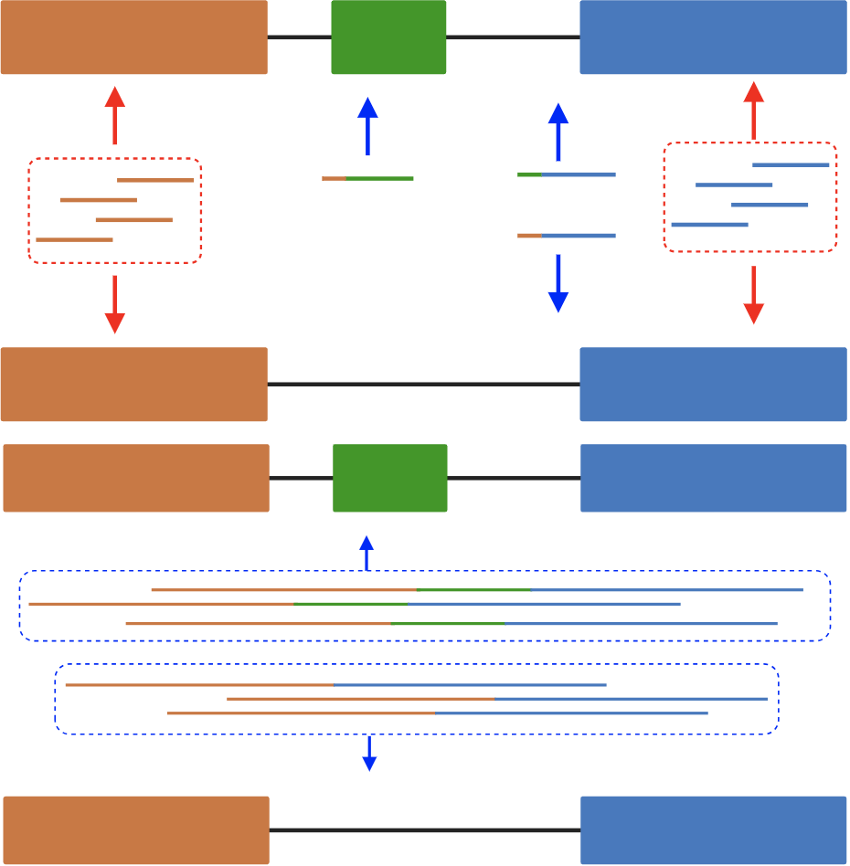
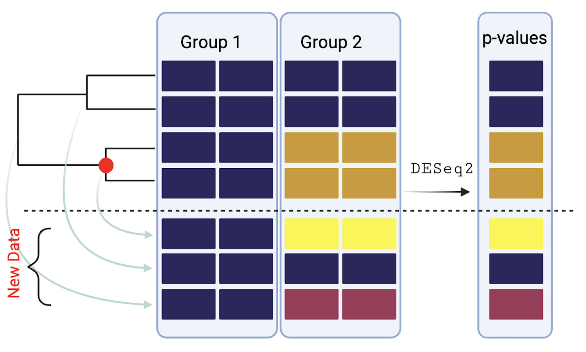
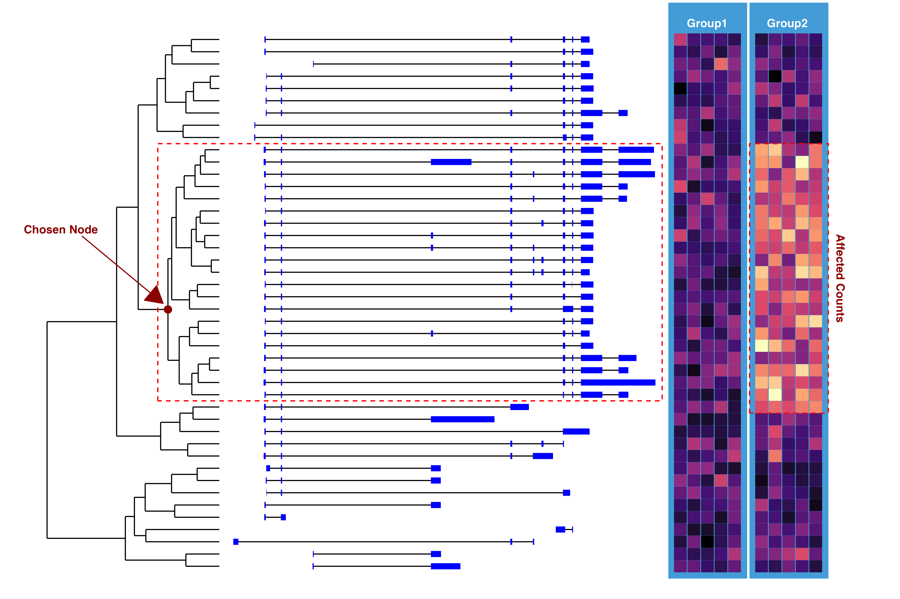

```{css, echo=FALSE}

.col-break {
  break-before: column;
}


.my-ref .references div {
font-size: 12pt; /* set the reference size*/
}
/* This fixes the reference Numbering */
.csl-left-margin {
  float: left;
}
.csl-right-inline {
  margin-left: 20px;
}

.poster_body p strong {
  color: #CC0000; /*bold color*/
}

.poster_body p {
  font-size: 40px;
}

h5#affiliation {
  font-size: 30pt; /*affiliation text size*/
}

.poster_body img {
  margin-top: 0;
}

```

```{r setup, include=FALSE}
knitr::opts_chunk$set(echo = FALSE, cache = TRUE, message = FALSE)
box::use(ggplot2[...], dplyr[...], tidyr[...], ggside[...]) 
```

```{r functions}
box::use(mods/gr,
         mods/sims,
         mods/tree,
         mods/similarity,
         mods/util[...]) |>
  suppressMessages()
row_mod <- tree$descendants_of_nodes(77, sims$.hclust)[[1]]
shift_fun <- function(affected_rows, affected_cols) {
  force(affected_rows)
  force(affected_cols)
  function(tse, delta) {
    sims$sim_mu(tse, affected_rows, affected_cols, delta = delta)
  }
}
shift_mu <- shift_fun(affected_rows = row_mod, affected_cols = 6:10)


simCountsEvalDeseq <- function(tse, ...) {

  tse <- sims$sim_counts(tse)
  ntse <- tree$tse_by_nodes(tse)
  sims$deseq(ntse, ~ groups, size_factors = 1L, ...)
}

do_sim <- function(tse, delta, n_sims = 10, ...) {
  
  tses <- lapply(delta, shift_mu, tse = tse)
  delta <- rep(delta, each = n_sims)
  tses <- rep(tses, each = n_sims)
  
  out <- purrr::map(tses, simCountsEvalDeseq, .progress = TRUE, ...)
  out <- purrr::map(out, `[[`, 2L)
  out <- purrr::map2(out, delta, \(x, y, z) {x[[z]] <- y; x}, z = 'delta')
  out
  
}

do_climb <- function(.data, method = c("strict", "ordered_pval"), note = "none", ..., affected_rows = row_mod) {
  method <- match.arg(method, c("strict", "ordered_pval"))
  args <- list(...)
  if (!is.list(.data))
    stop("`.data` should either be alist of `dds_node_res` or a `dds_node_res` object")
  
  #check if it is
  if (is.object(.data)) {
    #it is classed
    if (!inherits(.data, "dds_node_res"))
      stop("`.data` is not a `dds_node_res` object")
    .data <- list(.data)
  }
  
  .data <- lapply(.data, sims$climb, method = method, ...)
  out <- lapply(.data, sims$summarise_climb, affected_rows = affected_rows, delta = unique(delta))
  out <- dplyr::bind_rows(out)
  out$note <- note
  out$.data <- .data
  out$.method <- method
  out$.args <- list(args)
  out$.sim_number <- 1:nrow(out)
  out
} 

plot_summary <- function(climb_res, annotate_missing = TRUE) {
  p <- ggplot(climb_res, aes(x = FDR, y = sens, group = .sim_number)) +
    geom_point(data = ~subset(.x, !is.nan(FDR)),
               color = "steelblue", fill = "steelblue") +
    facet_wrap(~delta) +
    theme_bw() 
  
  if (annotate_missing) {
    p <- p + geom_label(
      data = ~subset(.x, is.nan(FDR)) |>
        dplyr::summarise(nexclude = dplyr::n(), .by = c(delta, note)),
      aes(x = 0, y = -.05, label = paste0('excluded: ',round(nexclude, 0)),
          group = delta), inherit.aes = F,
      hjust = 0, vjust = 1) +
      ylim(c(-.2, 1))
  }
  p
  
}

```


\usepackage{mathtools}

# Background

One **Gene** may be translated into *mRNA* and then spliced into multiple transcripts named **isoforms**. **Isoforms** may be modulated by splicing factors within the cell. @Kim2021 
```{r, mapping-difference, out.width= "50%", out.extra='style="float:right; padding-left:40px"'}


```

**RNAseq** takes a snapshot of a cell's gene expression profile at the time of sequencing. Short read sequencing, 100-250 base pairs, required estimating which **isoform** is present since the read may be contained within one *exon*. **Long read sequencing** may span multiple *exons*, providing more confidence on the transcript **isoform** detected at the expense of read depth.

**Goal:** Develop an isoform-grouping method to facilitate isoform-level **differential expression (DE)** analysis using long-read sequencing data while controlling for False Positives for differential expression.

# DE Testing of Inner Nodes

```{r inner-node-merge, out.width= "80%", fig.align='center'}
#out.extra='style="float:left; padding:10px"', fig.cap=""

``` 

A gene with $N$ isoforms implies $N-1$ inner nodes for its associated tree. These inner nodes are the sum of the leaves of a sample.
Once we have our extended data, we perform `DESeq2` @R-DESeq2 and evaluate the resulting **pvalues** with our tree Climbing algorithm.

# Cluster Tree Generation Method

To Generate Hierarchical clusters, we generated a **similarity metric** based on the similarities between transcripts as opposed to using data dependent counts.
Let $G$ represent a set of isoforms of size $g$. given any indexes $i$, $j \le g$ , define $G_i$ and $G_j$ as isoforms $i$ and $j$ from $G$ such that they represent sets of exons of size $N$ and $M$ respectively. For any two $i$ and $j$, we can define the similarity as:

$$
S_{ij}(G_i,G_j) = \frac{2\sum_n^N\sum_m^MJ(G_{i_n}, G_{j_m})}{N + M} \hspace{1cm} J(G_{i_n}, G_{j_m}) = \frac{G_{i_n}\cap G_{j_m}}{G_{i_n}\cup G_{j_m} }
$$


# Simulation Methods {.col-break}

Choose an inner node within the tree and shift the mean of all leaves for a particular group by some delta. We can evaluate our Tree climbing algorithm based on how well it accurately chooses the known perturbed nodes.

```{r data-setup-fig1, message=FALSE}

box::use(mods/util[...])
data <- sims$gr_sub
exon_ <- unlist(data$exons)

clust <- sims$.hclust
data_clust <- tree$dendro_data(clust)
n_orig <- length(clust$order)
n <- (2L*n_orig) - 1L
sprintfmt <- paste0("node_%0", floor(log10(n))+1L, "i")

#rdata <- rowData(se) |> as_tibble(rownames = "nodes")
data_clust$node <- rep(as.integer((n_orig + 1L):n), each = 3)
data_clust$nodes <- sprintf(sprintfmt, data_clust$node)

plot_data <- tibble::tibble(
  start = data@ranges@start,
  end = start + data@ranges@width - 1L,
  seqnames = as.character(data@seqnames)
)

plot_data <- plot_data[clust$order,]
plot_data$cluster_order <- 1:nrow(plot_data)
plot_data <- plot_data[order(clust$order),]

exon_data <- tibble::tibble(
  start = exon_@ranges@start,
  end = start + exon_@ranges@width - 1L,
  seqnames = as.character(exon_@seqnames),
  cluster_order = vec_rep(plot_data$cluster_order, vapply(data$exons, length, 1L))
)


.miny <- min(data_clust$y, data_clust$yend)
.maxy <- max(data_clust$y, data_clust$yend)
data_clust <- mutate(data_clust,
       across(starts_with("y"), ~-.x),
       across(starts_with("y"), ~scales::rescale(.x, from = c(-.env$.maxy, -.env$.miny),to = c(810000, 824000))))
```

```{r fig1, fig.align='center', fig.width=13, fig.height=8}
perturbed_node <- filter(data_clust, node == 77L, y==yend)
.x <- perturbed_node$y
.y <- mean(c(perturbed_node$x, perturbed_node$xend))
p <- ggplot(plot_data) +
  geom_segment(aes(x = start, xend = end, y = cluster_order, yend = cluster_order)) +
  geom_segment(
      aes(x = y, y = x, xend = yend, yend = xend),
      data = data_clust,
      inherit.aes = F
    ) +
  geom_rect(
  xmin = 819000, ymin = 14.5, ymax= 35.5, xmax = 860000,
  alpha = 0,
  #fill = "red",
  color = 'red',
  linetype = "dashed") +
    theme_void() +
    labs(x = "Genome Position",
         y = "Cluster Label") +
  geom_point(
    mapping = aes(x = .env$.x, y = .env$.y),
    inherit.aes = F,
    size = 3,
    color = "darkred"
  ) +
  annotate(geom = "segment", x = .x - 7000, y = .y + 6,
           xend = .x - 400, yend = .y + .5, arrow = arrow(type = "closed"),
           arrow.fill = "darkred", color = "darkred") +
  annotate(geom = "text", x = .x - 7500, y = .y + 6, label = "Chosen Node",
           vjust = -.3, hjust = .7, color = "darkred", fontface = "bold") +
  geom_rect(
    aes(xmin = start, ymin = as.integer(cluster_order) - .25,
        xmax = end, ymax = as.integer(cluster_order) + .25),
    data = exon_data,
    fill = "blue", inherit.aes = F
  ) 

set.seed(43)
mat_data <- expand_grid(
  xmin = 1:11,
  ymin = 1:44
) |>
  mutate(
    groups = case_when(xmin <= 5 ~ "G1", TRUE ~ "G2"),
    affect = between(ymin,14, 35),
    mu = case_when(affect&groups=="G2" ~ 20, TRUE ~ 10),
    counts = rnbinom(n(),size = 100, mu = mu)
  ) |>
  filter(xmin!=6)
mat_data2 <- mutate(
  mat_data,
  xmin = scales::rescale(xmin, to = c(861000, 872000))
)

pp <- p + 
  geom_rect(
  xmin = 860500, xmax = 866900,
  ymin = 0, ymax = 47,
  fill = "#469CD4",
  alpha = .1
  ) +
  geom_rect(
  xmin = 867100, xmax = 873500,
  ymin = 0, ymax = 47,
  fill = "#469CD4",
  alpha = .1
  ) +
  geom_text(
    data = tibble(x = c(863500, 870000),
                  t = c("Group1", "Group2")),
    aes(x = x, y = 45, label = t),
    color = "white",
    fontface = "bold",
    hjust = .45,
    vjust = 0
  ) +
  geom_rect(
  data = mat_data2,
  aes(xmin = xmin, xmax = xmin + 950, ymin = ymin - .45, ymax = ymin + .45,
      fill = counts, color = counts)
)  +
  geom_rect(
    xmin = 867100, xmax = 873500,
    ymin = 13.5, ymax = 35.5,
    fill = "darkred",
    alpha = 0,
    color = "red",
    linetype = "dashed"
  ) +
  annotate('text', x = 874500, y = mean(c(14,35)), label = "Affected Counts",
           angle = -90, color = "darkred", fontface = "bold") +
  scale_fill_viridis_c(option = "A") +
  scale_color_viridis_c(option = "A") +
  guides(fill = "none", color = "none")
p_out <- pp + xlim(c(809500, 876000))
# ggsave("fig/sim-method.png", p_out, device = "png", width = 12, height = 8, dpi = 400, units = "in")
# 
p_out

```

Let $\mu_{ij}=\mu_0 + \delta_{ij}$, $\mu_0 = 10$ and $\delta_{ij} = 0$ for $i,j$ in the control group, and $\delta_{ij} = \hat \delta$ for $i,j$ in the affected group. Each entry, $X_{ij}$, is sampled as follows.
$$
X_{ij} \sim \text{Nbinom}(\mu_{ij},\ \alpha = 100)
$$


# Simulation Sensitivity


```{r reading-topdown-res, getting-data}
out <- readRDS(here::here("sim-50-out.rds"))

topdown <- do_climb(out, method = "ord")
```


```{r plot-scatter-sens-fdr, plotting-results, fig.align='center'}
p_sens <- mutate(topdown,
       delta = factor(paste0("widehat(delta) == plain(",delta,")"), levels = paste0("widehat(delta) == plain(",seq(.5, 6, by = .5),")"))) |>
ggplot(aes(FDR, sens)) + 
  geom_point(data = ~filter(.x, !is.nan(FDR)), 
             color = "steelblue", size = 3, alpha = .3) +
  facet_wrap(~delta, labeller = "label_parsed") +
    theme_classic() +
    theme(axis.title = element_text(face = "bold", size = 24),
          strip.text = element_text(face = "bold", size = 14),
          axis.text = element_text(size = 12)) +
  scale_x_continuous(breaks = c(0, .5, 1), labels = c("0", ".5", "1")) +
  scale_y_continuous(breaks = c(0, .5, 1), labels = c("0", ".5", "1")) +
  labs(y = "Sensitivity", x = "False Discovery Rate")
```

```{r plot-example-climb}
bad_sim <- sims$plot_results(topdown$.data[[11]]) +
  geom_rect(
    data = 
      tribble(
        ~xmin, ~xmax, ~ymin, ~ymax,
        14.5, 21.5, -.4, 1.1,
        22.5, 24.5, -.4, .75,
        28.5, 30.5, -.4, .68,
        40, 44, 3.5, 4
      ),
    aes(xmin = xmin, xmax = xmax, ymin = ymin, ymax = ymax),
    inherit.aes = F,
    alpha = .1,
    fill = 'lightgreen'
  ) +
  geom_rect(
    data = tribble(
      ~xmin, ~xmax, ~ymin, ~ymax,
      .5, 2.5, -.4, 1,
      6.5, 9.5, -.4, 1.3,
      35.5, 37.5, -.4, 1.1,
      39.5, 41.5, -.4, .4,
      40, 44, 2.5, 3
    ),
    aes(xmin = xmin, xmax = xmax, ymin = ymin, ymax = ymax),
    inherit.aes = F,
    alpha = .1,
    fill = 'red'
  ) +
  geom_rect(
    data = tribble(
      ~xmin, ~xmax, ~ymin, ~ymax,
      2.5, 6.5, -.4, .1,
      9.5, 14.5, -.4, .1,
      37.5, 39.5, -.4, .1,
      41.5, 44.5, -.4, .1,
      40, 44, 3, 3.5
    ),
    aes(xmin = xmin, xmax = xmax, ymin = ymin, ymax = ymax),
    inherit.aes = F,
    alpha = .1,
    fill = 'blue'
  ) +
  geom_rect(
    data = tribble(
      ~xmin, ~xmax, ~ymin, ~ymax,
      21.5, 22.5, -.4, .1,
      24.5, 28.5, -.4, .1,
      30.5, 35.5, -.4, .1,
      40, 44, 2, 2.5
    ),
    aes(xmin = xmin, xmax = xmax, ymin = ymin, ymax = ymax),
    inherit.aes = F,
    alpha = .1,
    fill = 'orange'
  )  +
  geom_text(
    data = tibble(y = seq(2.25, 3.75, by = .5), x = 42, label = c("FN","FP","TN","TP")),
    aes(x = x, y = y, label = label)
  ) +
  theme(axis.line = element_blank(), axis.text = element_blank(), axis.ticks = element_blank(),
        legend.position = "none") +
  geom_segment(x = -.5, xend = -.5, y = 0, yend = 4.5, data = data.frame(x= 1)) +
  geom_text(aes(x = x, y = y,label = l), data = tibble(y = 1:4, x = -1, l = y), hjust = 1) +
  geom_segment(aes(x = x, xend = -.8, y = y, yend =y),  data = tibble(y = 1:4, x = -.5, l = y)) +
  ggtitle("Imperfect Simulation")

good_sim <- sims$plot_results(topdown$.data[[84]]) +
  geom_rect(
    data = 
      tribble(
        ~xmin, ~xmax, ~ymin, ~ymax,
        14.5, 35.5, -.4, 1.4,
      ),
    aes(xmin = xmin, xmax = xmax, ymin = ymin, ymax = ymax),
    inherit.aes = F,
    alpha = .1,
    fill = 'lightgreen'
  ) +
  geom_rect(
    data = tribble(
      ~xmin, ~xmax, ~ymin, ~ymax,
      .5, 14.5, -.4, .1,
      35.5, 44.5, -.4, .1,
    ),
    aes(xmin = xmin, xmax = xmax, ymin = ymin, ymax = ymax),
    inherit.aes = F,
    alpha = .1,
    fill = 'blue'
  ) +
  theme(axis.line = element_blank(), axis.text = element_blank(), axis.ticks = element_blank(),
        legend.position = "none") +
  geom_segment(x = -.5, xend = -.5, y = 0, yend = 4.5, data = data.frame(x= 1)) +
  geom_text(aes(x = x, y = y,label = l), data = tibble(y = 1:4, x = -1, l = y), hjust = 1) +
  geom_segment(aes(x = x, xend = -.8, y = y, yend =y),  data = tibble(y = 1:4, x = -.5, l = y)) +
  ggtitle("Perfect Simulation")
```

```{r sens, fig.width=5.5, fig.height=5.5, out.extra='style="float:right; padding-left:40px"'}
p_sens
```
We conducted 50 simulations per $\hat\delta \in \{0.5, 1, 1.5, ..., 6\}$ and evaluated how often our tree climbing algorithm correctly merged the known perturbed data. Merged nodes with $\delta_{ij}=0$ are **False Positives** and unmerged nodes of with $\delta_{ij}=\hat\delta$ are considered **False Negatives** in the tree climbing context.

```{r cowplot, fig.width= 12, fig.height=5.5, fig.align='center'}
# cowplot::plot_grid(
#   p_sens, ncol = 2,
  cowplot::plot_grid(
    bad_sim,
    good_sim, ncol = 2
  )
# )

```

# Count Splitting @neufeld2022inference {.col-break}

```{r read-null-sim}
tse_null <- readRDS(here::here("sim-null.rds"))
tse_null_res <- do_climb(tse_null, method = "order", note = "null", affected_rows = integer())
```


```{r plot-pvals-null, out.width= "50%", out.extra='style="float:left; padding:10px"'}
dplyr::bind_rows(tse_null_res$.data) |> 
    subset(keep) |>
    dplyr::mutate(internalNode = factor(ifelse(n_children>1, "Internal Node", "Leaf"),c("Leaf", "Internal Node"))) |>
    ggplot(aes(x = pvalue)) +
    geom_histogram(aes(y = after_stat(count),
                       fill = internalNode), bins = 15, position = "stack") +
    theme_classic() +
    theme(legend.position = "bottom",
          axis.text = element_text(face = "bold", size = 16),
          plot.title = element_text(face = "bold", size = 20)) +
    scale_fill_manual(values = c("steelblue", "darkred")) +
    labs(fill = "", title = expression(500~simulations~of~widehat(delta)==0)) 
```

While at higher $\hat\delta$ shifts in our simulations are able to identify the correct inner node, but we also need to consider the case of the **null hypothesis**. To assess the distribution of pvalues under the assumption that there is no difference in the $\mu_{ij}$, we ran simulations with $\hat\delta = 0$.

There is an **enrichment of low pvalues** among the **inner nodes** in the **null hypothesis simulations**. To correct this we can apply **count splitting**. The count splitting method is formulated for experiments that use the same data for feature selection as they use for analysis. @neufeld2022inference

```{r functions2}
split_counts <- function(se) {
  
  sims <- cnts <- assay(se, 'counts')
  sims[] <- rbinom(prod(dim(se)), size = cnts, prob = 0.5)
  test <- train <- se
  assay(train, 'counts') <- sims
  assay(test, 'counts') <- cnts - sims
  test@metadata$original <- se
  list(train = train, test = test)
}

do_splitCounts <- function(tse, delta, n_sims = 10, ..., method = c("ordered_pval", "strict")) {
  box::use(purrr[map, map2], DESeq2[...])
  method <- match.arg(method, choices = c("ordered_pval", "strict"))
  tses <- lapply(delta, shift_mu, tse = tse)
  delta <- rep(delta, each = n_sims)
  tses <- rep(tses, each = n_sims)
  
  #sim counts
  tses <- map(tses, sims$sim_counts)
  splits <- map(tses, split_counts)
  tests <- map(splits, `[[`, 2L)
  train <- map(splits, `[[`, 1L)
  trained <- map2(train, 
                  delta,
                 function(x, d, ...) {
                   ntse <- tree$tse_by_nodes(x)
                   out <- sims$deseq(ntse, ~ groups, size_factors = 1L, ...)[[2L]]
                   out[['delta']] <- d
                   out
                 }, ..., .progress = "train-data")
  
  trained <- do_climb(trained, method = method, note = "split_counts")
  
  trans_test <- map2(tests, trained$.data, tse_by_climb, .progress = "transform-test-data")
  trans_tested <- map2(trans_test,
                       delta,
                       purrr::safely(
                         function(x, d, ...) {
                           suppressMessages({
                             dds <- DESeqDataSet(x, design = ~ groups)
                             sizeFactors(dds) <- 1L
                             dds <- DESeq(dds, quiet = T, ...)
                             res_names <- resultsNames(dds)
                             out <- lapply(res_names, function(x) results(object = dds, name = x))
                           })
                           out <- out[[2]]
                           out[['delta']] <- d
                           out
                         }, otherwise = "FAILED"), ..., .progress = "test-data")
  
  list(trained_res = trained, tested = trans_tested)
  
}

qcolSum <- function(x, na.rm = FALSE) {
  n <- nrow(x)
  dn <- ncol(x)
  .Internal(colSums(x, n, prod(dn), na.rm))
}
tse_by_climb <- function(tse, climb_res) {
  

  keep <- subset(climb_res, keep)
  n_col <- ncol(tse)
  col_nms <- colnames(tse)
  dimnms <- list(keep$nodes, col_nms)
  lst_mat <- vector('list', nrow(keep))
  Assays <- SummarizedExperiment::assays(tse)
  NewAssays <- vector('list', length(Assays))
  i_seq <- seq_along(lst_mat)
  desc <- keep$descendants
  node_name <- keep$nodes
  for (j in seq_along(NewAssays)) {
    assay_j <- Assays[[j]]
    for (i in i_seq) {
      lst_mat[[i]] <- matrix(
        data = qcolSum(assay_j[desc[[i]],, drop = FALSE]),
        nrow = 1L,
        ncol = n_col,
        dimnames = list(node_name[i], col_nms)
      )
    }
    NewAssays[[j]] <- do.call('rbind', lst_mat)
  }
  names(NewAssays) <- names(Assays)
  md <- c(list(
    TreeSummarizedExperiment = tse
  ), tse@metadata)
  md <- md[!duplicated(names(md))]
  SummarizedExperiment::SummarizedExperiment(
    assays = NewAssays,
    rowData = methods::as(keep, "DataFrame"),
    colData = SummarizedExperiment::colData(tse),
    metadata = md
  )
  
  
}
```

$$
X_{ij} \sim \text{Nbinom}(\mu_{ij}, \alpha = 100)\\
X_{ij}^\text{train} \sim \text{Bin}(X_{ij}, \theta = 0.5)\\
X_{ij}^\text{test} = X_{ij} - X_{ij}^\text{train}
$$

```{r plotting_countsplit, fig.width=12, fig.align='center'}
box::use(SummarizedExperiment[...])
tse <- sims$tse_sim(10)
tse$groups <- factor(as.character(rep(c(1,2), each = 5)))
assay(tse, 'mu') <- assay(tse)
assay(tse, 'mu')[] <- 100L

.nolegend <- theme(legend.position = "none")
#out <- do_splitCounts(tse, 0, n_sims = 100)
#saveRDS(out, here::here("posterdown", "split_count.rds"))
out <- readRDS(here::here("posterdown", "split_count.rds"))
.train <- out$trained_res$.data |>
  dplyr::bind_rows() |> 
    subset(keep) |>
    dplyr::mutate(internalNode = factor(ifelse(n_children>1, "Internal Node", "Leaf"),c("Leaf", "Internal Node"))) |>
    ggplot(aes(x = pvalue)) +
    geom_histogram(aes(y = after_stat(count),
                       fill = internalNode), bins = 15, position = "stack") +
    theme_classic() +
    theme(legend.position = "right",
          axis.text = element_text(face = "bold", size = 16),
          axis.title = element_text(face = "bold", size = 18),
          plot.title = element_text(face = "bold", size = 20)) +
    scale_fill_manual(values = c("steelblue", "darkred")) +
    labs(fill = "", title = expression(Train~Data:~100~simulations~of~widehat(delta)==0)) 
.legend <- .train |> {
  \(x) cowplot::get_legend(x + theme(legend.position = "top"))
}()


test_res <- lapply(out$tested, function(x) x$result)
failed_tests <- which(vapply(test_res, \(x) identical(x,"FAILED"), T ))
test_null_split <- test_res[-failed_tests] |>
  lapply(\(x) {
    x$internalNode <- factor(ifelse(as.integer(sub('node_','',rownames(x)))>44L, "Internal Node", "Leaf"),c("Leaf", "Internal Node"))
    x$keep <- TRUE
    tibble::as_tibble(x)
  }) |>
  dplyr::bind_rows()

.test <- test_null_split |>
  subset(keep) |>
    ggplot(aes(x = pvalue)) +
    geom_histogram(aes(y = after_stat(count),
                       fill = internalNode), bins = 15, position = "stack") +
    theme_classic() +
    theme(legend.position = "right",
          axis.text = element_text(face = "bold", size = 16),
          axis.title = element_text(face = "bold", size = 18),
          plot.title = element_text(face = "bold", size = 20)) +
    scale_fill_manual(values = c("steelblue", "darkred")) +
    labs(fill = "", title = expression(Test~Data:~100~simulations~of~widehat(delta)==0)) 

cowplot::plot_grid(
  .legend,
  cowplot::plot_grid(
    .train + .nolegend, .test + .nolegend, align = "h"
  ),
  rel_heights = c(.1, 1), nrow = 2
)

```

# Conclusions

1. Simulations of a single gene of 44 isoforms can reliably detect the correct node with $\log_2$ fold change of 0.5 between groups.
2. Utilization of count splitting controls for type 1 error under the null hypothesis.

# Future Directions

1. Improve speed of data merging step.
2. Apply tree climbing and count splitting methods on real data sets.


# References {.my-ref}
